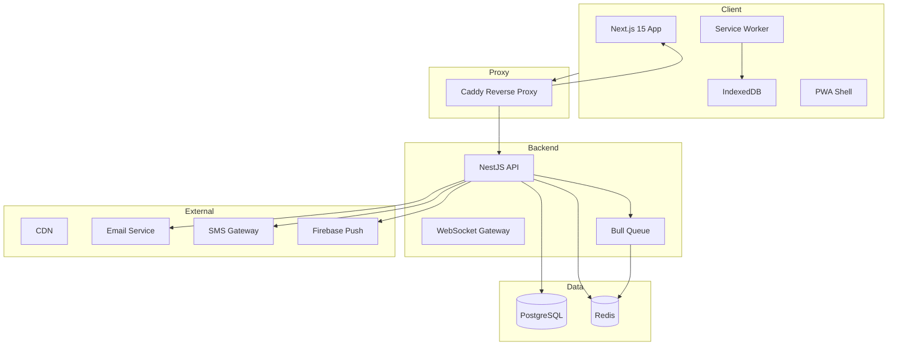

# ClearPath Architecture

## System Overview

ClearPath is a full-stack enterprise application for digital student clearance and exam eligibility verification. It follows a modern monorepo architecture with three packages:

```
clearpath/
├── apps/backend/       # NestJS API server
├── apps/frontend/      # Next.js 15 PWA client
├── packages/shared/    # Shared types, validators, constants
├── docker/             # Docker Compose + Dockerfiles
├── e2e/                # Playwright E2E tests
└── .github/            # CI/CD workflows
```

## Architecture Diagram



## Tech Stack

| Layer | Technology | Purpose |
|-------|-----------|---------|
| Frontend | Next.js 15 + React 19 | SSR, PWA, static generation |
| Styling | TailwindCSS 4 + shadcn/ui | Design system, dark mode |
| Animations | Framer Motion | UI animations, page transitions |
| State | TanStack Query | Server state, caching |
| Backend | NestJS 10 | REST API, modular architecture |
| ORM | Prisma 5 | Type-safe database access |
| Database | PostgreSQL 16 | Primary data store |
| Cache | Redis 7 | Session, queue, rate limiting |
| Queue | Bull + ioredis | Background job processing |
| Auth | JWT + Passport | Authentication & RBAC |
| Docs | Swagger/OpenAPI | API documentation |
| Proxy | Caddy 2 | Reverse proxy, TLS, compression |

## Key Patterns

### 1. Feature-Based Modules
Each feature is self-contained: `controller -> service -> prisma`

### 2. Clearance Workflow
6-stage sequential approval: Finance -> Library -> Lab -> Sports -> Department -> Registrar

### 3. Offline-First PWA
- Service Worker with cache-first & network-first strategies
- IndexedDB for structured offline data
- Background Sync for pending actions

### 4. Security
- JWT with refresh tokens
- HMAC-signed QR codes (anti-tampering)
- Helmet security headers
- Rate limiting per IP
- CSRF protection
- Input validation

## Data Flow

```
User Action -> React Component -> TanStack Query -> Axios -> Caddy -> NestJS -> Prisma -> PostgreSQL
                                                                                -> Redis
                                                                                -> Bull Queue
```
